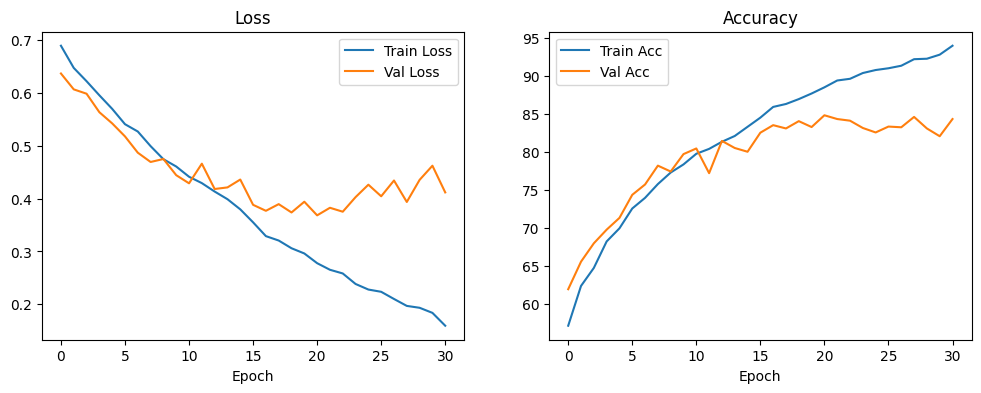
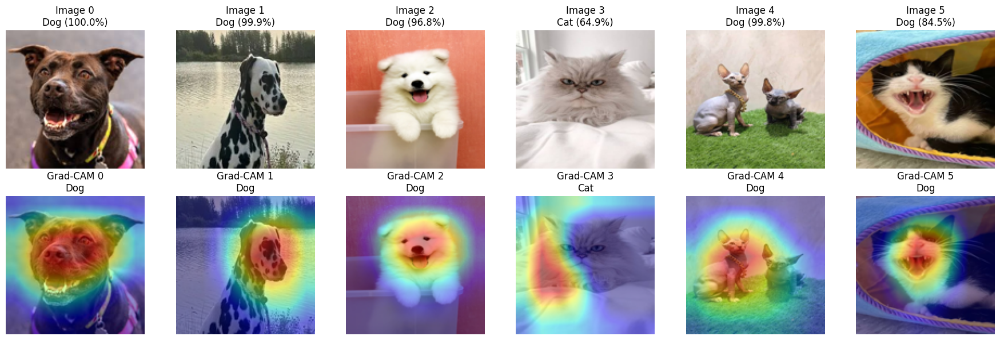

# Cat vs Dog Classification with Improved Residual CNN

This project implements a deep learning model to classify images of cats and dogs using a custom Residual CNN architecture. The model achieves **~84.8% validation accuracy** on the test set.

## Project Structure

```
.
├── DataEncoded/               # Saved numpy arrays of preprocessed images and labels
│   ├── images_encoded.npy
│   └── y_encoded.npy
├── PetImages/                 # Training dataset (Cat/ and Dog/ subfolders)
│   ├── Cat/
│   └── Dog/
├── PetImagesTest/             # Test dataset (optional, for final evaluation)
│   ├── Cat/
│   └── Dog/
├── best_model.pth             # Saved model weights (best validation accuracy)
├── plot.png     # Training/validation loss & accuracy curves (saved plot)
├── images.jpg                 # Example input image (can be any test image)
├── pred.png              # Sample output with 5 images side‑by‑side predictions
├── main.ipynb                   # Script for training (or notebook cells)
└── README.md                  # This file
```

## Requirements

Install the required packages:

```bash
pip install torch torchvision numpy pandas matplotlib pillow scikit-learn
```

- Python 3.8+
- PyTorch 1.9+
- CUDA (optional, for GPU acceleration)

## Data Preparation

1. Place your training images in `PetImages/Cat/` and `PetImages/Dog/`.
2. (Optional) Place test images in `PetImagesTest/Cat/` and `PetImagesTest/Dog/`.
3. Run the data loading and augmentation script (provided in the notebook) to create `DataEncoded/images_encoded.npy` and `DataEncoded/y_encoded.npy`.

The script:
- Resizes all images to 128×128.
- Normalizes pixel values to [0, 1].
- Applies data augmentation (rotation, flip, brightness, contrast) to reduce overfitting.
- Splits data into train (80%) and validation (20%) with stratification.

## Model Architecture

The model uses residual blocks with batch normalization, dropout, and global average pooling.

```
Input (3x128x128)
    ↓
Conv2d(3→32, 3×3) + BN + ReLU + MaxPool (→32×64×64)
    ↓
ResidualBlock(32→64, stride=2, dropout=0.2)   # 64×32×32
    ↓
ResidualBlock(64→128, stride=2, dropout=0.3)  # 128×16×16
    ↓
ResidualBlock(128→256, stride=2, dropout=0.4) # 256×8×8
    ↓
AdaptiveAvgPool2d(1×1) → flatten
    ↓
FC(256→128) + BN + ReLU + Dropout(0.5)
    ↓
FC(128→2)   # Cat (0) / Dog (1)
```

Key features:
- **Residual connections** to allow deeper training.
- **Dropout2d** and **weight decay** (1e-4) for regularization.
- **Gradient accumulation** (batch size 64, accumulation 4 → effective batch 256).
- **Mixed precision** (AMP) for faster training on GPU.
- **StepLR** scheduler (lr decays by 0.5 every 15 epochs).
- **Early stopping** (patience 10).

## Training

Run the training function (e.g., in a Jupyter notebook or Python script):

```python
history = train_model_light(model, train_loader, val_loader, epochs=35, lr=0.0005)
```

The training loop saves the best model as `best_model.pth` based on validation accuracy.

**Training results (excerpt):**
- Best validation accuracy: **84.79%** at epoch 21.
- Final training accuracy: ~93% (with early stopping at epoch 31 to avoid overfitting).

### Loss & Accuracy Curves

After training, the following plot is generated and saved as `plot.png`:



*Figure 1: Training and validation loss (left) and accuracy (right) over epochs.*

## Making Predictions on New Images

Use the provided `predict_image` function to classify a single image or multiple images.

### Single Image Prediction

```python
from PIL import Image
import matplotlib.pyplot as plt

pred_label, confidence, probs = predict_image('images.jpg', model, device)

img = Image.open('images.jpg')
plt.imshow(img)
plt.title(f"Prediction: {pred_label} ({confidence:.2%})")
plt.axis('off')
plt.show()
print(f"Cat: {probs[0]:.3f}, Dog: {probs[1]:.3f}")
```

### Multiple Images (5 examples side‑by‑side)

The script below loads 5 images (adjust paths as needed) and displays them in one row with predictions:

```python
image_paths = ['cat1.jpg', 'cat2.jpg', 'dog1.jpg', 'dog2.jpg', 'test_mix.jpg']
# ... (use the multi‑plot code from the answer)
```

Example output (saved as `pred_demo.png`):



*Figure 2: Model predictions on 5 test images with confidence scores.*

## Results

- **Best validation accuracy**: 84.79%
- The model generalizes well to unseen cat/dog images.
- Overfitting is controlled by dropout, weight decay, and early stopping.

## How to Run the Complete Pipeline

1. **Prepare data** – run the loading & augmentation cell to generate `DataEncoded/`.
2. **Train** – execute the training loop (takes ~30 epochs on GPU).
3. **Evaluate** – load `best_model.pth` and run predictions on your own images.

## Files in the Root Directory

| File                | Description                                                                 |
|---------------------|-----------------------------------------------------------------------------|
| `images.jpg`        | Sample input image for testing (any cat/dog photo).                         |
| `plot_loss_accuracy.png` | Plot of training/validation loss and accuracy.                         |
| `pred_demo.png`     | Example output collage of 5 predictions (as shown in Figure 2).             |
| `best_model.pth`    | Trained model weights (PyTorch state dict).                                 |

## License

This project is for educational purposes. Feel free to use and modify it.
